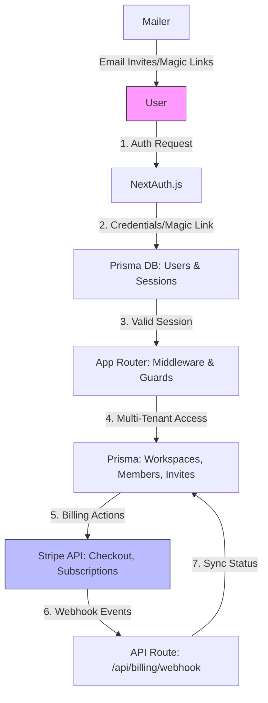

# System Architecture Overview

This document provides an overview of the SaaS starter's architecture, highlighting key components, data flow, folder structure, and database schema. The design emphasizes scalability, security, and ease of deployment using modern Next.js patterns.

## High-Level Data Flow

The application follows a multi-tenant architecture where users authenticate via NextAuth, access sessions, interact with Prisma-managed data (workspaces, members, invites), and handle billing through Stripe integrations.

### Mermaid Diagram: Core Data Flow



- **User Authentication**: Starts with NextAuth, storing sessions in the database.
- **Multi-Tenancy**: Prisma relations enforce workspace isolation (e.g., users belong to multiple workspaces via memberships).
- **Billing Integration**: Stripe handles payments; webhooks update local billing status asynchronously.
- **Email Delivery**: Optional SMTP for invites and auth; stubs for local development.

## Folder Structure

The project uses Next.js 14 App Router for routing and server components. Key directories:

- **`src/app/`**: App Router pages and layouts.
  - `(marketing)/`: Public landing page and invite acceptance.
  - `(auth)/`: Login and verification flows.
  - `(app)/`: Protected dashboard, settings, and billing pages.
- **`src/components/`**: Reusable UI elements (shadcn/ui-based) and domain-specific (e.g., forms, navigation).
- **`src/lib/`**: Utilities like env validation, logger, Prisma client, and rate limiting.
- **`src/server/`**: Server-side logic (auth, billing, mailer) and actions (Zod-validated forms).
- **`prisma/`**: Database schema and seed data.
- **`tests/`**: Unit (Vitest) and E2E (Playwright) tests.
- **`docs/`**: Documentation for installation, deployment, and operations.

This structure separates concerns: client UI, server actions, and shared utilities, enabling server-side rendering and API routes.

## Database Schema Highlights

Powered by Prisma with SQLite for development (easily swappable to Postgres). The schema supports multi-tenancy through relations.

Key models from [`prisma/schema.prisma`](../../../prisma/schema.prisma):

- **User**: Core identity with email, timezone, and relations to accounts, sessions, and memberships.
  ```prisma
  model User {
    id                  String              @id @default(cuid())
    email               String              @unique
    timezone            String              @default("UTC")
    memberships         WorkspaceMember[]
    invites             WorkspaceInvite[]   @relation("invite_creator")
    defaultWorkspace    Workspace?          @relation("default_users")
  }
  ```

- **Workspace**: Tenant isolation with plan, billing status, and Stripe IDs.
  ```prisma
  model Workspace {
    id                          String              @id @default(cuid())
    name                        String
    plan                        Plan                @default(FREE)
    billingStatus               BillingStatus       @default(NONE)
    stripeCustomerId            String?
    memberships                 WorkspaceMember[]
    invites                     WorkspaceInvite[]
  }
  ```

- **WorkspaceMember**: Role-based access control (RBAC) linking users to workspaces.
  ```prisma
  model WorkspaceMember {
    id          String           @id @default(cuid())
    role        WorkspaceRole    @default(MEMBER)
    status      MembershipStatus @default(ACTIVE)
    userId      String
    workspaceId String
    user        User             @relation(fields: [userId], references: [id])
    workspace   Workspace        @relation(fields: [workspaceId], references: [id])
  }
  ```

- **WorkspaceInvite**: Invite tracking with tokens and expiration.
  ```prisma
  model WorkspaceInvite {
    id          String           @id @default(cuid())
    email       String
    role        WorkspaceRole    @default(MEMBER)
    token       String           @unique
    status      InviteStatus     @default(PENDING)
    workspaceId String
    creatorId   String?
    workspace   Workspace        @relation(fields: [workspaceId], references: [id])
    creator     User?            @relation("invite_creator")
  }
  ```

- **AuditLog**: Compliance logging for actions.
  ```prisma
  model AuditLog {
    id          String    @id @default(cuid())
    workspaceId String?
    actorId     String?
    action      String
    target      String?
    metadata    Json?
    workspace   Workspace? @relation("workspace_logs")
    actor       User?      @relation("audit_actor")
  }
  ```

Enums like `Plan` (FREE, PRO), `WorkspaceRole` (OWNER, ADMIN, MEMBER), and `BillingStatus` (NONE, ACTIVE, etc.) enforce data integrity.

For full schema, refer to [`prisma/schema.prisma`](../../../prisma/schema.prisma). Migrations ensure schema evolution; seed data populates demo workspaces.

## Integration Points

- **NextAuth**: Custom providers in [`src/server/auth.ts`](../../../src/server/auth.ts).
- **Prisma Client**: Initialized in [`src/lib/prisma.ts`](../../../src/lib/prisma.ts) with connection pooling.
- **Stripe**: Client in server actions, webhooks for async updates.

This architecture scales horizontally on Vercel, with database sharding possible via Postgres extensions.

See [Features](features.md) for implementation details and [README](../README.md) for setup.